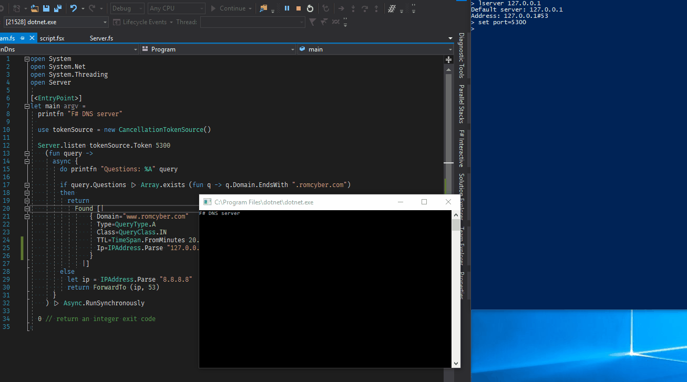

# FunDns

This project is not destinated to be in production.
The goal is only to understand DNS protocol and love F#.

## Why did I do this ?

Since few years I am using DNS protocol with a question:
Am I able to code my own server in .NET ?

.NET framework proposes the [HttpListener](https://docs.microsoft.com/fr-fr/dotnet/framework/network-programming/httplistener) who help us to create quickly a self hosted HTTP server.

I found it fun to create a `DnsListener` to develop quickly my small DNS server with my own logic to resolve my domain names.

# Understanding the protocol

I just want to implement the most basic parts of the protocol.
If I don't know a domain, __I want to fallback request to another DNS server__.

So I need to be able to __receive__ and __send__ requests.

This project is only for fun, so RFC is too complete for my use case.

I prefer to understand the protocol using __nslookup__, __wireshark__ and articles like:
- [https://www.frameip.com/dns/](https://www.frameip.com/dns/)  (it's in french)
- [http://www.tcpipguide.com/free/t_DNSMessageHeaderandQuestionSectionFormat.htm](http://www.tcpipguide.com/free/t_DNSMessageHeaderandQuestionSectionFormat.htm)

## NSLookup

I use Windows 10 and Mac Os to develop.
Under Windows 10, I had some problems to specify another port than 53 to send DNS requests.

I suggest to [activate bash under Windows](https://blogs.technet.microsoft.com/canitpro/2016/06/07/step-by-step-enabling-bash-on-windows-10/)

Sending a basic request:

```shell
$ nslookup www.romcyber.com

Server:         192.168.1.1
Address:        192.168.1.1#53

Non-authoritative answer:
Name:   www.romcyber.com
Address: 195.154.102.61
```

Sending requests to local server on port 5300:

```shell
$ nslookup
> lserver 127.0.0.1
> set port=5300
> www.romcyber.com

Server:         192.168.1.1
Address:        192.168.1.1#53

Non-authoritative answer:
Name:   www.romcyber.com
Address: 127.0.0.1
```

# Big endian

DNS protocol uses big endian for bytes ordering.
So I need to create helpers for binary reading and writing with .NET

## Extending types

F# gives possibility to simply extend existing types (without inheritance).

So I extended BinaryReader:

```fsharp
type BinaryReader with
  member __.ReadBigEndianUInt16 () =
    let b1 = __.ReadByte()
    let b2 = __.ReadByte()
    uint16 (b1 ||| b2 <<< 8)
```
and BinaryWriter:

```fsharp
type BinaryWriter with
  member __.WriteBigEndianUInt16(value:uint16) =
    __.BaseStream.Write([| byte (value >>> 8) ; byte value |], 0, 2) 
  member __.WriteBigEndianInt32(value:int32) =
    let data =
      [| byte value 
         byte (value >>> 8)
         byte (value >>> 16)
         byte (value >>> 24) |]
    __.BaseStream.Write(data, 0, 4)
```

## Domain modeling

After understanding of datagrams I designed my domain like:

```fsharp
type Header =
  { Id:uint16
    Flags:HeaderFlags
    QdCount:uint16
    AnCount:uint16
    NsCount:uint16
    ArCount:uint16 }
 and HeaderFlags =
  { Qr:byte; OpCode:byte
    Aa:byte; Tc:byte
    Rd:byte; Ra:byte
    Z:byte; Rcode:byte }

type QueryType =
  | A     = 1  //a host address
  | NS    = 2  //an authoritative name server
  | MD    = 3  //a mail destination (Obsolete - use MX)
  | MF    = 4  //a mail forwarder (Obsolete - use MX)
  | CNAME = 5  //the canonical name for an alias
  | SOA   = 6  //marks the start of a zone of authority
  | MB    = 7  //a mailbox domain name (EXPERIMENTAL)
  | MG    = 8  //a mail group member (EXPERIMENTAL)
  | MR    = 9  //a mail rename domain name (EXPERIMENTAL)
  | NULL  = 10 // a null RR (EXPERIMENTAL)
  | WKS   = 11 // a well known service description
  | PTR   = 12 // a domain name pointer
  | HINFO = 13 // host information
  | MINFO = 14 // mailbox or mail list information
  | MX    = 15 // mail exchange
  | TXT   = 16 // text strings

type QueryClass = 
  | IN = 1
  | ANY = 255

type Query =
  { Header:Header
    Questions:Question array
    Answers:Answer array }
and Question = 
  { Domain:string
    Type:QueryType
    Class:QueryClass }
and Answer = 
  { Domain:string
    Type:QueryType
    Class:QueryClass
    TTL:TimeSpan
    Ip:IPAddress }
```

Header contains 8 flags encoded on 2 bytes.
So we need to manipulate bits for serialization.

```fsharp
[< RequireQualifiedAccess >]
module HeaderFlags =
  let toBytes (h:HeaderFlags) =
    let flag1 =
      0uy 
      |> writeBits 7 1 h.Qr
      |> writeBits 3 1 h.OpCode
      |> writeBits 2 1 h.Aa
      |> writeBits 1 1 h.Tc
      |> writeBits 0 1 h.Rd
    let flag2 =
      0uy 
      |> writeBits 7 1 h.Ra
      |> writeBits 6 3 h.Z
      |> writeBits 0 4 h.Rcode
    [|flag1;flag2|]
```

Other fields will be serialized simply using the extended __BinaryWriter__

# Playing with my project

At first clone the repository.

Open __Program.fs__.

The function __Server.listen__ takes 3 arguments.
 - a __CancellationToken__ to be able to stop the server.
 - a port number to listen.
 - a function to implement your own resolution logic.

With the following sample, I create a DNS server replacing IP of domain www.romcyber.com by my local IP.
When client requests another domain, then I forward to the Google's DNS.

```fsharp
Server.listen tokenSource.Token 53
    (fun query ->
      async {
        do printfn "Questions: %A" query

        if query.Questions |> Array.exists (fun q -> q.Domain.EndsWith ".romcyber.com")
        then 
          return
            Found [|
                { Domain="www.romcyber.com"
                  Type=QueryType.A
                  Class=QueryClass.IN
                  TTL=TimeSpan.FromMinutes 20.
                  Ip=IPAddress.Parse "127.0.1.1"
                }
              |]
        else
          let ip = IPAddress.Parse "8.8.8.8"
          return ForwardTo (ip, 53)
      }
    ) |> Async.RunSynchronously
```


Result is:



